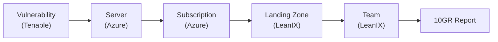
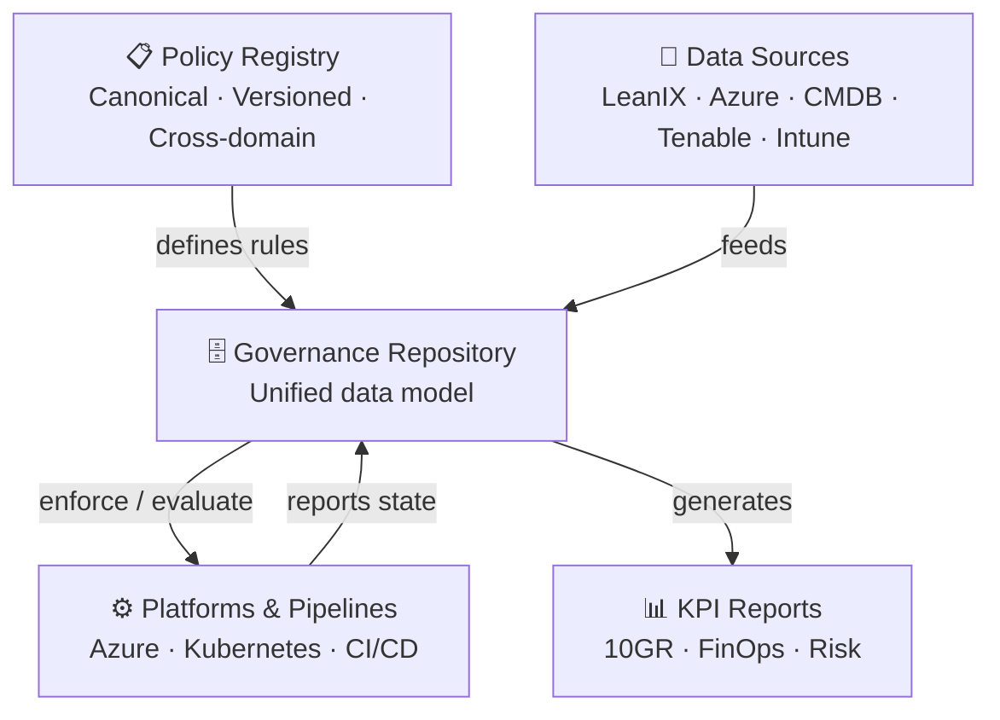

# Governance Engineering

### A Vision for Automatic IT Governance

Jan Harms · ista SE · 2026

---
layout: default
---

# Agenda

<v-clicks>

1. **Why governance fails** — four predictable root causes
2. **The vision** — automatic, data-driven governance
3. **Four building blocks** — how to get there
4. **Today vs. tomorrow** — the path from here
5. **Open questions**

</v-clicks>

---
layout: center
class: text-center
---

# The Core Idea

<br>

> **The goal of governance is not to slow things down.**  
> **It is to make the right thing the easy thing.**

<br>

Organizations make thousands of technology decisions every day.  
Without structure, systems **drift** — and drift creates risk, cost, and misalignment.

---
layout: two-cols
---

# Why Governance Fails

Four predictable failure modes:

<v-clicks>

- **Siloed policies** — every discipline publishes its own rules
- **Stale & invisible** — documents have no incentive to stay current
- **Disconnected data** — same concept, different name in every system
- **Manual gatekeepers** — approval committees become bottlenecks

</v-clicks>

::right::

<div class="mt-12 ml-8">
<v-clicks>

```text
Architecture ──┐
Security    ───┤  Each publishes
Platform    ───┤  independently
Data        ───┤
Finance     ───┘

Result: overlapping,
contradictory, ignored
```

</v-clicks>
</div>

---

# Failure 1: Siloed Policies

Each discipline defines governance independently:

| Discipline | Focus |
|---|---|
| Enterprise Architecture | Structure and evolution |
| Security Governance | Risk and control |
| Platform Governance | Technical guardrails |
| Data Governance | Classification and usage |
| Financial Governance | Cost accountability |

**Consequence:** Conflicting signals. Teams learn to ignore governance entirely.

---

# Failure 3: Disconnected Data — A Real Example

> KPI dashboards for the **10 golden rules of IT security** are generated from LeanIX.

**What happens when data is stale:**

<v-clicks>

- Teams waste effort investigating **non-issues**
- Real issues go **undetected**
- Compliance is measured against a **snapshot of reality that no longer exists**

</v-clicks>

<br>



---

# Failure 4: Manual Gatekeepers

<div class="grid grid-cols-2 gap-8">
<div>

**The two failure modes:**

1. **Gatekeepers become bottlenecks**
   - Committees overloaded
   - Teams route around the process

2. **Approvals expire silently**
   - Compliant at review time
   - No one checks 6 months later

</div>
<div>

**Consequence:**
- Governance applied inconsistently
- Non-compliant configurations persist forever
- Good relationships → faster approvals than good architecture

</div>
</div>

---
layout: center
class: text-center
---

# The Vision: Automatic Governance

---

# Automatic Governance Architecture



---

# Building Block 1: Policy Registry

A **single authoritative source** for all policies.

<v-clicks>

- Policies defined **as code**, versioned in a repository
- Changes surfaced via **diffs and automated notifications** — just like software changes
- One team owns the canonical model; disciplines contribute via defined process
- **No more conflicting signals**

</v-clicks>

---

# Building Block 2: Governance Repository

A **unified data model** that resolves identities across all systems.

<v-clicks>

- Canonical identifiers enforced at ingestion
  - Deployment rejected if `application` tag ≠ valid LeanIX ID
- API-driven integration — no manual CSV exports
- One **owning system** per entity type:

</v-clicks>

<v-click>

| Entity | Owning System |
|---|---|
| Applications | LeanIX |
| Servers | Azure / CMDB |
| Teams | Org structure |
| Landing Zones | LeanIX + Azure |

</v-click>

---

# Building Block 3: Automated Controls

Two enforcement modes:

| Mode | Mechanism | Example |
|---|---|---|
| **Prevent** | Platform rejects non-compliant action | Deployment blocked if app tag invalid |
| **Detect & Alert** | State reported; violation flagged | Vulnerable server exposed → immediate alert |

<br>

**Additional enforcement without querying the repo:**
- Azure Policies, Kyverno for Kubernetes
- Compliant-by-design platforms (encrypted DBs, LZ ownership)
- **Golden Paths** — make the compliant option the easiest option

---

# Building Block 4: Real-Time KPI Reporting

**Today — manual, slow, error-prone:**
```
Azure → CMDB → Tenable → 10GR Report
         ↑
    LeanIX (subscription → 10GR group, manual export)
```

**With Governance Repository:**
```
Azure + LeanIX + CMDB + Tenable
         ↓
  Governance Repository  (live, canonical)
         ↓
  10GR Report · FinOps · Risk Dashboard
```

---

# Today vs. Tomorrow

| Today (CMDB-centric) | Vision (Governance Repository) |
|---|---|
| Tags manually maintained in IFS Assyst | Tags derived automatically from canonical sources |
| CMDB exports to Tenable and EDR | All systems pull from unified governance data |
| KPI reports via manual CSV flow | Real-time queries against live governance model |
| Human approval gates | Automated enforcement + exception handling |

<br>

> The current **server tagging initiative** is a pragmatic first step.  
> The **Governance Repository** is the destination.

---

# Open Questions

<v-clicks>

- 🔐 **Exemptions** — who can approve, for how long, with what audit trail?
- 🏗️ **How to build** — custom platform, data mesh, or AI-assisted aggregation?
- 🔑 **Canonical identifiers** — which to standardize first? (Application, LZ, Team)
- 🔄 **Dynamic org structure** — how to handle squad reshuffling and tribe changes?
- 🤝 **Who owns the Governance Repo?** — IT Strategy + Data Platform?

</v-clicks>

---
layout: center
class: text-center
---

# Thank You

**Governance Engineering** — making the right thing the easy thing.

<br>

*Questions?*

---
layout: default
---

# Appendix: Key Data Sources

| Source | Data |
|---|---|
| **LeanIX** | Applications, Landing Zones, team accountability |
| **Azure Resource Manager** | Infrastructure, subscriptions, resource metadata |
| **CMDB (IFS Assyst)** | Asset inventory, server ownership (transitional) |
| **Tenable** | Vulnerability posture per asset |
| **Intune / Jamf** | Device compliance, installed software |
| **SAP / Workday** | Cost centers, team allocations |
| **Confluence** | Team topology, responsibilities |
